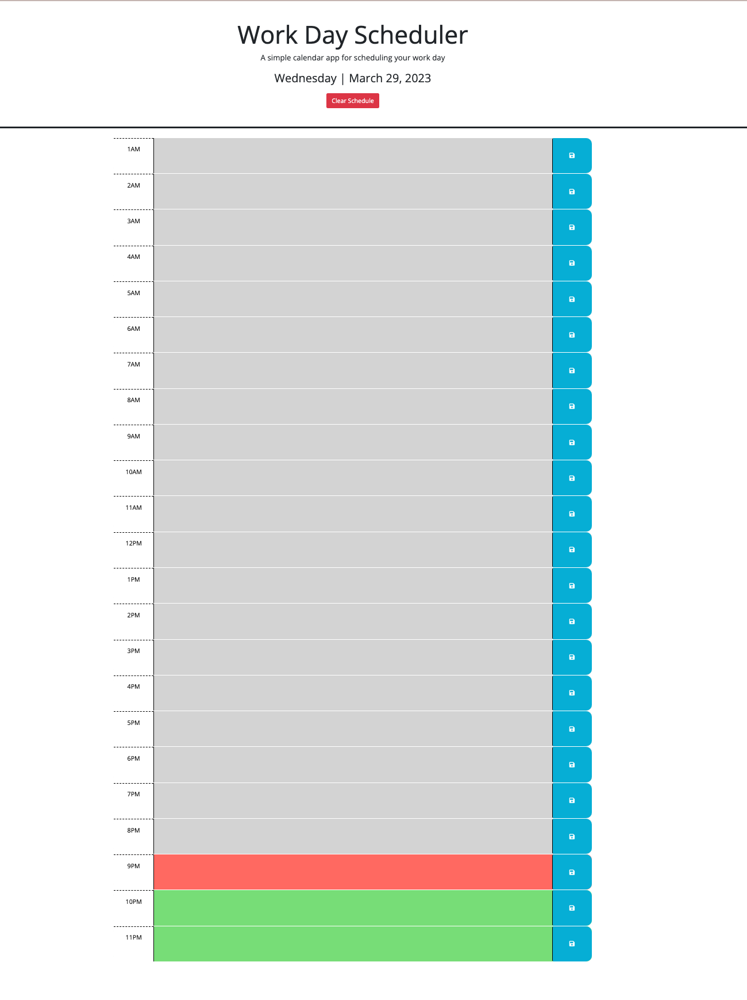

# Simple Day Scheduler

### About
This is a basic day calendar application where users can add daily events to each hour of the day to keep track of important tasks.

When the user opens the calendar, the current day (generated by DayJs) is displayed at the top. 
As the user scrolls down, they will see timeblocks representing each hour of the day.
Each timeblock is color coded to represent past (gray), present (red), and future (green).
When the user clicks on a timeblock, they can input an event and save it by clicking the save button to the right. The input from the user will save even after refreshing.
The user may also clear their entire schedule by clicking the red "Clear Schedule" button at the top to refresh it for the next day.

### Deployed application link
[Simple Day Scheduler](https://ashtreid.github.io/day-scheduler/)

### Screenshot of website
